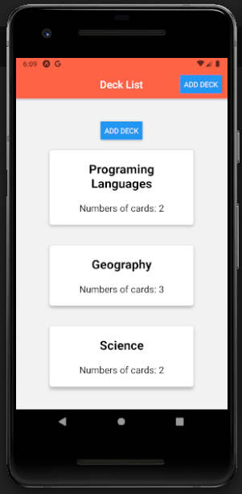

# Mobile Flashcards

This is my final assessment project for Udacity's React Native course.

# Tested on
✔️ Android
✔️ Web
❌ iOS

## Installation

1. `npm install` or `yarn install`
2. `npm start` or `yarn start`

## Features

* The user can create, delete or add cards to decks
* The user can start a quizz, each quizz is a series of questions (cards)
* A notification is sent at 8pm if the user didn't complete a quizz for the day

## Missing features

* Syncing Redux with AsyncStorage
* iOS hasn't been tested
* The design is minimal

## Dependencies

React-Native, React-Navigation, Expo, Redux, Immer, Styled Components
